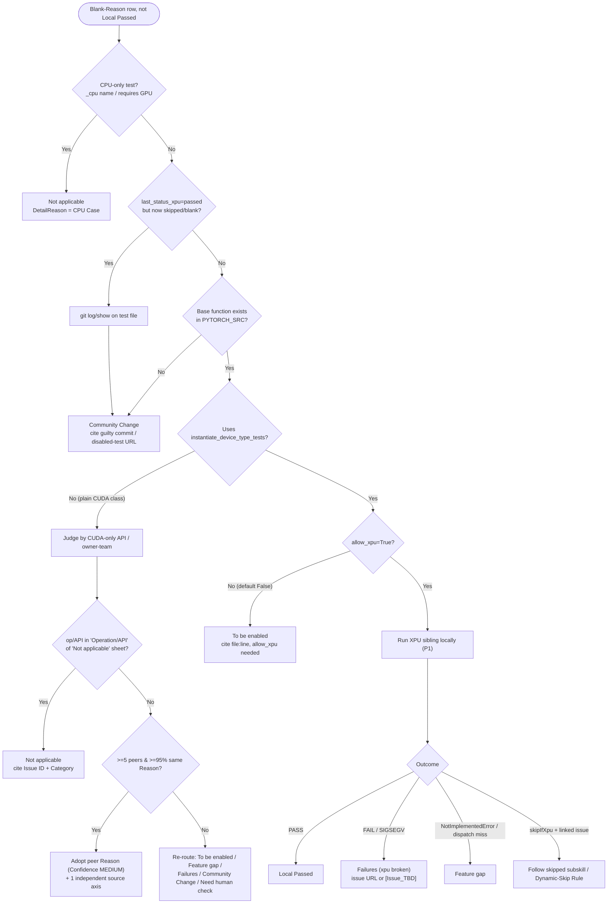
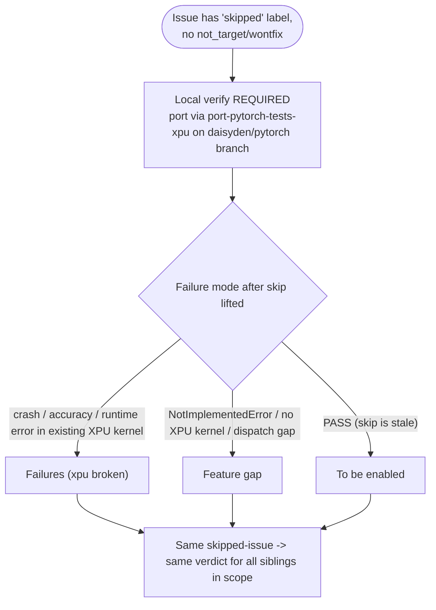

# classify_ut — Workflow Chart

End-to-end flow for classifying blank-`Reason` rows in XPU UT status workbooks.

## High-level pipeline

```mermaid
flowchart TD
    Start([New classification session]) --> PrepGate{Run optional preparation?<br/>requested OR verdict needs fresh local run}

    PrepGate -- "No (default)" --> InitWB
    PrepGate -- Yes --> S_Neg1

    subgraph S_Neg1["Preparation (OPTIONAL) — classify_ut/preparation/SKILL.md"]
        EnvNeg1["Environment Setup: update_env_from_nightly.sh"]
        EnvNeg1 --> InstallWheel["pip install --pre torch + pytorch-triton-xpu<br/>(from /tmp, PyPI XPU nightly = source of truth)"]
        InstallWheel --> AlignPT["Align PYTORCH_SRC to torch.version.git_version<br/>(auto-stash if dirty, then detach)"]
        AlignPT --> AlignXPU["Align torch-xpu-ops to SHA in third_party/xpu.txt"]
        AlignXPU --> Provenance["Write provenance JSON<br/>(versions, SHAs, xpu_available)"]
        Provenance --> Step0["Local Pre-Screen (OPTIONAL):<br/>run_blank_local_prescreen.py <workbook.xlsx>"]
        Step0 --> LocalResult["Write local_result = STATUS;log_path<br/>{PASS,FAIL,ERROR,TIMEOUT,SKIP,SEGFAULT}"]
    end

    LocalResult --> InitWB

    subgraph S0_prep["Workbook init (always)"]
        InitWB["Open target sheet"]
        InitWB --> ReasonTBD["Init Reason TBD from ORIGINAL workbook<br/>(blank Reason -> True). NEVER modify again"]
        ReasonTBD --> DeriveXPU["Derive XPU metadata from CUDA when blank<br/>CUDA->XPU, _cuda->_xpu"]
    end

    DeriveXPU --> PassCheck{Pre-screen ran AND<br/>local_result == PASS?}
    PassCheck -- "PASS (TERMINAL)" --> LocalPassed["Reason = Local Passed<br/>DetailReason cites log path<br/>SKIP all subskills & further analysis"]
    LocalPassed --> Save
    PassCheck -- "non-PASS / no pre-screen = analyze" --> Route

    Route{Route by status_xpu} -- blank/empty --> BlankSkill["classify_ut/blank/SKILL.md<br/>case-existence analysis"]
    Route -- failed --> FailedSkill["classify_ut/failed/SKILL.md<br/>failure-message + local-run + issue search"]
    Route -- "skipped / xfail" --> SkippedSkill["classify_ut/skipped/SKILL.md<br/>skip-message + linked issue + source"]

    BlankSkill --> Policy
    FailedSkill --> Policy
    SkippedSkill --> Policy

    subgraph POL["User Policy Overrides (authoritative)"]
        Policy["P1 local-retest mandate · P2 NA must carry evidence (don't run)<br/>P3 JIT = Not applicable"]
    end

    Policy --> Classify

    subgraph CLS["Classification decision"]
        Classify["Assign canonical Reason + DetailReason"]
        Classify --> Conf["Tag Confidence: HIGH (issue URL / log / file:line)<br/>MEDIUM (best-fit, no link) / LOW -> Need human check"]
    end

    Conf --> Save

    subgraph OUT["Output"]
        Save["Mark cells blue (ADD8E6) · save evidence to<br/>/tmp/opencode/<workbook>_local_verify/"]
        Save --> SaveWB["Save as .agent.xlsx (never modify original)"]
        SaveWB --> Verify["Verify: 0 blank Reason rows · ZIP integrity · counts match"]
    end

    Verify --> Done([Done])
```

## Reason-label decision (per row, after routing)

## Skipped-label (Dynamic-Skip) sub-flow

