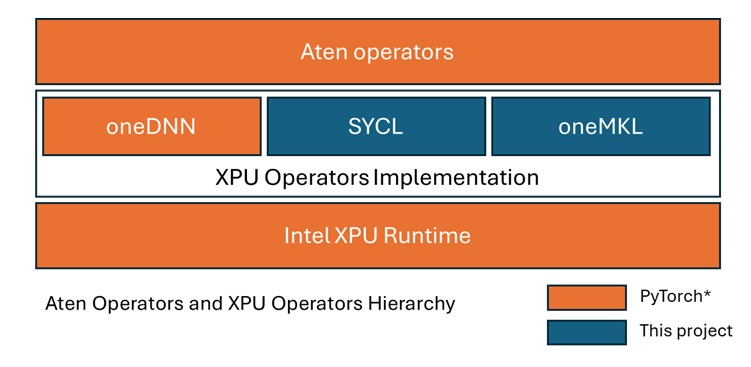

# Torch XPU Operators*

Test

Torch XPU Operators* project is an integral part of [PyTorch](https://github.com/pytorch/pytorch) to support Intel GPUs (the device backend name of Intel GPUs in PyTorch is XPU). The PyTorch build system automatically clones this repository at the pin pointed commit, branch, or tag specified in the following file of the [PyTorch repository](https://github.com/pytorch/pytorch):

* https://github.com/pytorch/pytorch/blob/main/third_party/xpu.txt

Cloned copy becomes available at `./third_party/torch-xpu-ops/` relative to the root of the checked out PyTorch tree.

Torch XPU Operators* implements most of the operators for Intel GPU devices accessible via PyTorch XPU acceleration backend:

* PyTorch ATen operators
* Torchvision operators

<p align="center">
    
</p>

Most operators are implemented as SYCL kernels, the sources of which are available in this repository. Some operators (linear algebra)
are implemented through calls to the [Intel® oneAPI Math Kernel Library (oneMKL)](https://www.intel.com/content/www/us/en/developer/tools/oneapi/onemkl.html).

Note that a few operators (convolution and matrix-matrix multiplication (`gemm`)) for the PyTorch XPU backend are implemented directly in PyTorch sources through calls to the [oneAPI Deep Neural Network Library (oneDNN)](https://github.com/uxlfoundation/oneDNN). These sources can be found in the PyTorch repository at https://github.com/pytorch/pytorch/tree/main/aten/src/ATen/native/mkldnn/xpu.

## Requirements

For the hardware and software prerequiste, please refer to [PyTorch Prerequisites for Intel GPUs](https://www.intel.com/content/www/us/en/developer/articles/tool/pytorch-prerequisites-for-intel-gpus.html) to check your hardware and install the following packages.

* Intel GPU Driver: Install Intel GPU drivers along with compute and media runtimes and development packages.
* Intel® Deep Learning Essentials: Install a subset of Intel® oneAPI components needed for building and running PyTorch.

## Build and install

This project cannot be built or installed as a stand-alone. This project gets built when PyTorch is built with XPU backend support.

**To install PyTorch with XPU backend from pre-built binary packages**, use one of the available distribution channels:

* For release builds:

```
pip3 install torch torchvision torchaudio --index-url https://download.pytorch.org/whl/xpu
```

* For nightly builds

```
pip3 install --pre torch torchvision torchaudio --index-url https://download.pytorch.org/whl/nightly/xpu
```

**To build PyTorch with XPU backend from sources**, refer to the [Intel GPU Support](https://github.com/pytorch/pytorch/blob/main/README.md#intel-gpu-support) section of the [PyTorch documentation](https://github.com/pytorch/pytorch/blob/main/README.md#from-source). In summary, the PyTorch build for XPU backend can be triggered as follows:

```bash
git clone https://github.com/pytorch/pytorch.git && cd pytorch
pip install -r requirements.txt
python setup.py install >log.txt 2>&1
```

Look for the following lines in the log file indicating that XPU backend is being built:

```
$ cat log.txt | grep -E "(USE_XPU|USE_XCCL)\s*:"
--   USE_XPU               : 1
--   USE_XCCL              : ON
```

If building from sources, note the following environment variables which control the PyTorch XPU backend build:

| Environment variable | Default | Notes |
| --- | --- | --- |
| `USE_XPU` | `ON` | Enables XPU backend support |
| `USE_XCCL` | `ON` (>= PT2.8) | Enables XCCL distributed backend support |
| `TORCH_XPU_ARCH_LIST` | depends on the PT and OS versions | Build SYCL kernels for specified platform(s) |

The `TORCH_XPU_ARCH_LIST` allows to specify a comma separated list of platforms for which SYCL kernels will be built. This helps to reduce the build time. This option does not affect oneDNN- or oneMKL-based operators. Note that if PyTorch is executed on a platform that the SYCL kernels were not built for, then they are compiled just-in-time (JIT).

## Verification

Once PyTorch is built or installed, verify that PyTorch XPU backend is available as follows:

```
$ python3 -c "import torch; print(torch.xpu.is_available())"
True
python3 -c "import torch; print(torch.distributed.distributed_c10d.is_xccl_available())"
True
```

# FAQ

Some confusion might arise about relationship of this repostory and PyTorch XPU backend in general with [Intel® Extension for PyTorch](https://github.com/intel/intel-extension-for-pytorch). See answers on that below.

**Does the PyTorch XPU backend implementation use Intel® Extension for PyTorch?**

No. PyTorch XPU backend implementation does not use Intel® Extension for PyTorch and can be used without it levaraging:

- Standard PyTorch API to access eager mode operators, compile modules (including Triton kernels), profiling, etc.
- SYCL kernels to enhance applications with custom operators via PyTorch CPP Extension API

**Does Intel® Extension for PyTorch depend on this repository through the PyTorch XPU backend implementation?**

Yes. Intel® Extension for PyTorch relies on the PyTorch XPU backend implementation (which includes this repository) and augments it with additional features and operators.

## Security
See Intel's [Security Center](https://www.intel.com/content/www/us/en/security-center/default.html) for information on how to report a potential security issue or vulnerability.

See also: [Security Policy](SECURITY.md)

## License
[Apache License 2.0](LICENSE)
