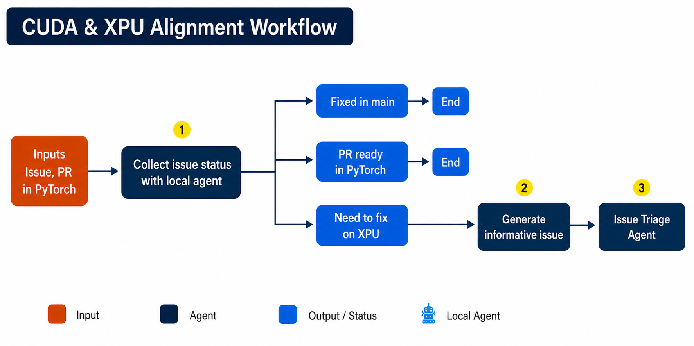
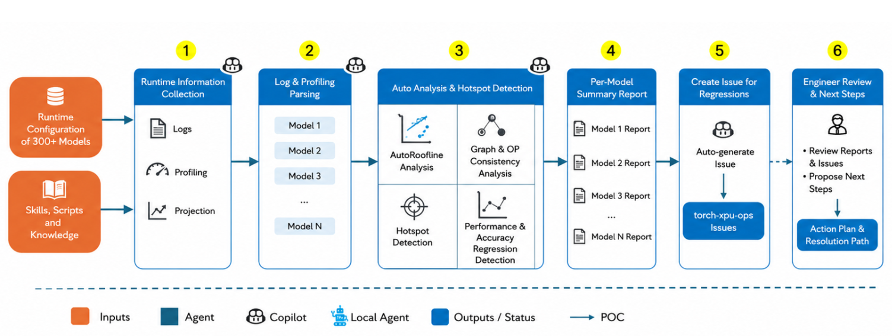
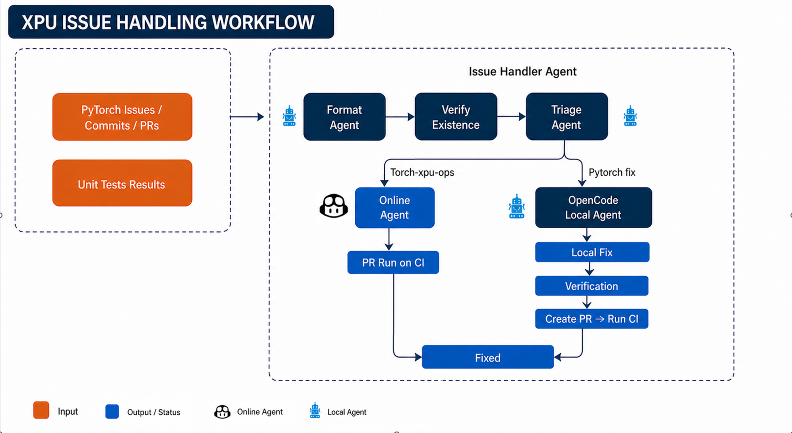

# RFC: Migrate `agentic_xpu` into `torch-xpu-ops`

## 1. Motivation
There are some the key challenges we are facing in PyTorch development and validation.
- First, maintaining CI stability is becoming increasingly costly. Frequent upstream changes continue to introduce XPU breakages, requiring engineers to spend substantial time on triage and issue resolution rather than feature development.
- Second, the scale of validation is growing rapidly. With more than 330,000 unit tests, manual failure analysis and root-cause investigation are becoming difficult to scale with the current engineering resources.
- Third, performance validation is also becoming a significant burden. We now track over 300 OOB models, and identifying regressions or optimization opportunities requires considerable expert effort and time.
- Finally, the volume of upstream information—including PRs, issues, and design discussions—continues to grow. Extracting actionable insights from this information stream is increasingly challenging.
Taken together, these challenges are creating a growing gap between workload growth and engineering capacity. We believe AI agents provide an opportunity to significantly improve engineering productivity, reduce manual effort, and enable the team to scale more effectively.

Taken together, these challenges are creating a growing gap between workload growth and engineering capacity. We believe AI agents provide an opportunity to significantly improve engineering productivity, reduce manual effort, and enable the team to scale more effectively.

## 2. Goal
We will use AI agent to build general workflow for every challege and make the skills to be reusable. The current scope mainly focus on the efficiency improvement for CI/CD. In the future we will extend the scope to the performance optimization and other feature development. 

## 3. Placement Target of Skills
- **Skills** (`agentic_xpu/skills/*`) → `torch-xpu-ops/.github/skills/`. This
  `skills` folder will only contain the markdown files. No scripts will be
  included here. So when the developer does not have the running scripts, one
  could still load the skills (like a local claude/opencode agent).
- **Scripts / Python package** (`agentic_xpu/scripts/*`,
  `agentic_xpu/agentic_xpu/issue_handler/`) →
  `torch-xpu-ops/tools/agentic_xpu/<scenario>/`. Each scenario folder will
  contain the README and the running scripts for local running.
- **Shared deps** → one `tools/agentic_xpu/requirements.txt` and
  `tools/agentic_xpu/.env`.

## 4. Target file structure (brief) for skills 
```
torch-xpu-ops/
├── .github/skills/
│   ├── nightly-ci-ut-fix/
│   ├── xpu-alignment/
│   ├── oob-perf-analysis/
│   └── issue-handler/            # nested sub-skills preserved for one specific scenario
│       ├── issue-fix/
│       ├── issue-triage/
│       └── ...
└── tools/
    └── agentic_xpu/
        ├── requirements.txt      # shared deps
        ├── .env                  # shared config
        ├── nightly_CI_ut_fix/    # scripts + README + assets
        ├── xpu_alignment/
        ├── oob_perf_analysis/
        └── issue_handler/        # python package: orchestrator, agents, config, utils
```

## 5. Scenarios (short description + workflow graph, no data)

### 5.1 `nightly_CI_ut_fix` — Nightly CI Failure Fix
Parses an XPU nightly CI failure report and produces per-case root cause and fix
diff in a dated summary.


### 5.2 `xpu_alignment` — CUDA–XPU Alignment Tracking
Scans `pytorch/pytorch` for issues/PRs/commits that may also affect XPU via
shared code paths; creates and fixes alignment issues.



### 5.3 `oob_perf_analysis` — OOB Model Performance Analysis
Analyzes out-of-box model performance on XPU (vs CUDA) from profiling artifacts,
with roofline and per-op breakdown.



### 5.4 `ut_scalable` / `issue_handler` — Scalable UT Issue Fix
Validates, triages, and fixes newly surfaced UT issues in a loop until fixed or
the attempt limit is reached.



## 6. PR Plan — one PR per scenario
| # | PR | Moves |
|---|---|---|
| 1 | `nightly_CI_ut_fix` | skill + `tools/agentic_xpu/nightly_CI_ut_fix/` |
| 2 | `xpu_alignment` | skill + `tools/agentic_xpu/xpu_alignment/` |
| 3 | `oob_perf_analysis` | skill + `tools/agentic_xpu/oob_perf_analysis/` |
| 4 | `issue_handler` (ut_scalable) | nested skill + `tools/agentic_xpu/issue_handler/` + `tools/agentic_xpu/requirements.txt` |

Each PR is self-contained (skill + scripts + README + assets for that scenario)
and independently reviewable. The `issue_handler` package is shared by
`ut_scalable` and `xpu_alignment`; it lands once in PR #4, and PR #2 references
it without duplication.

## 7. Notes
- **Naming:** final skill/folder naming (kebab-case vs. snake_case) is deferred
  to the implementing dev at PR time. The structure above keeps original
  `tools/agentic_xpu/` names and assumes kebab-case skill names to match
  existing `.github/skills/` convention.
- **Migration principle:** keep it simple — move content as-is, no behavior or
  layout changes beyond relocation.
