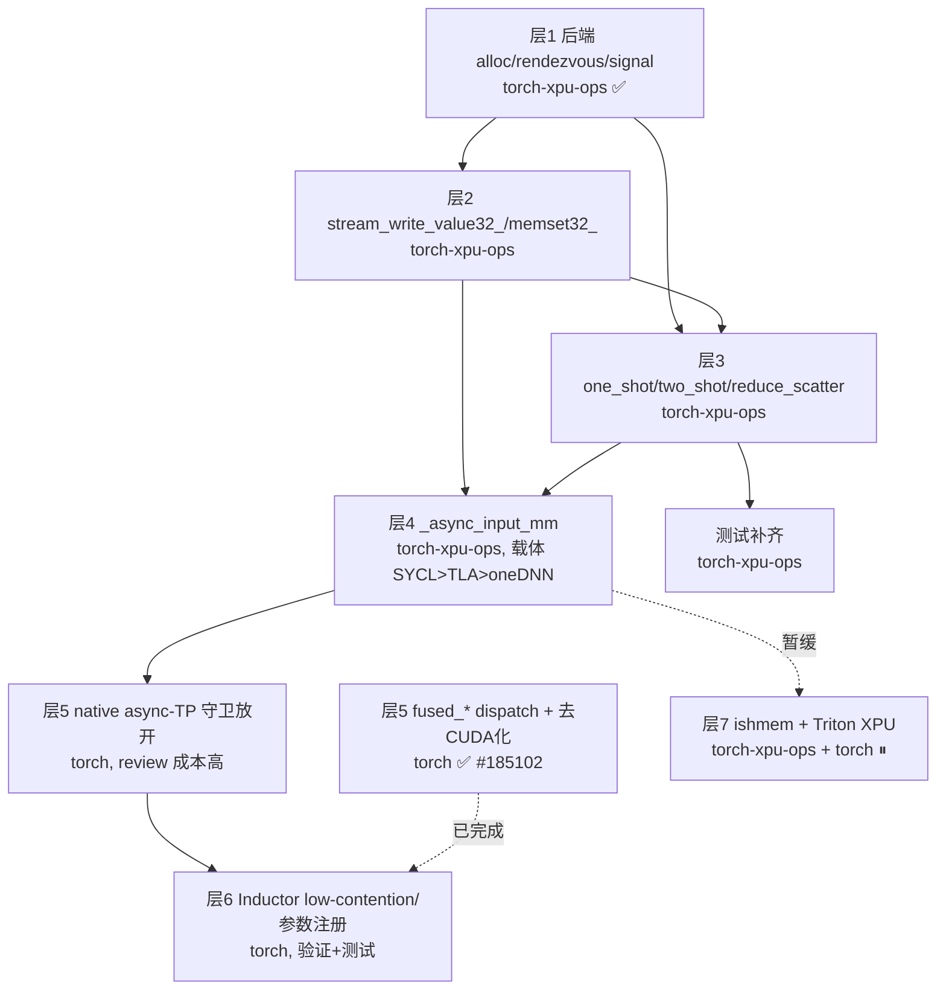

# XPU Symmetric Memory 对齐 CUDA：工作拆分与依赖分析

本文在 [symmetric_memory_overview.md](symmetric_memory_overview.md) 的分层结构基础上，
针对 **Intel XPU** 对齐 CUDA symm mem 能力，逐项拆解：

- 每项工作落在 **torch-xpu-ops** 库还是 **torch (pytorch/pytorch)** 库；
- 两者的 **PR review 成本差异**；
- 项与项之间的 **依赖关系**与建议顺序。

## 背景约束

- **无 multicast**：现存 XPU 计算卡走 PCIe，无 NVLink SHARP / NVLS 类组播能力
  → `multimem_*`、`memcpy_to_multicast_`、`has_multicast_support` 路径**永久 disable**，
  不在对齐范围内（测试保持 `TORCH_SYMM_MEM_DISABLE_MULTICAST=1`）。
- **仅节点内**：暂不做跨节点 scale-out → 不需要基于 oneCCL/ishmem 的第二后端。
- **MM 载体未定**：`_async_input_mm` 实现优先级 **SYCL kernel > SYCL-TLA > oneDNN**。
- **Triton XPU**：Triton 对 XPU 支持良好，但 Intel 侧 device-SHMEM 库 **ishmem** 进度
  缓慢 → 把 ishmem 作为 XPU symm backend 的时间点较晚，本轮不排入主线。

---

## 分层工作清单

### 层 1：后端分配与同步（torch-xpu-ops）

| 项 | 库 | 状态 | 工作 |
|---|---|---|---|
| `XPUSymmetricMemoryAllocator`（alloc/free/rendezvous，SYCL IPC） | torch-xpu-ops | ✅ 已完成 | — |
| `barrier` / `put_signal` / `wait_signal`（signal pad） | torch-xpu-ops | ✅ 已完成 | — |
| `has_multicast_support` / multicast ptr | torch-xpu-ops | ✅ 恒 false（符合约束） | 保持 |

结论：**地基已具备**，无需 torch 侧改动。

### 层 2：底层 memory 原语（torch-xpu-ops）

| 项 | 库 | 状态 | 依赖 |
|---|---|---|---|
| `stream_write_value32_` | torch-xpu-ops | ❌ 缺 | 层 1 |
| `memset32_` | torch-xpu-ops | ❌ 缺 | 层 1 |

schema 已在 torch 的 [SymmetricMemory.cpp](torch/csrc/distributed/c10d/symm_mem/SymmetricMemory.cpp)
里定义好（`TORCH_LIBRARY_FRAGMENT`），XPU 只需 `TORCH_LIBRARY_IMPL(symm_mem, XPU)` 补实现。
**纯 torch-xpu-ops 工作，无需动 torch。**

**易混淆点：这两个原语和层 1 的 `put_signal`/`wait_signal` 不是同一类东西。**
它们解决的是**不同轴向**的同步，不能互相替代：

| 维度 | `put_signal` / `wait_signal`（层 1，已实现） | `stream_write_value32` / `memset32`（层 2） |
|---|---|---|
| 执行方式 | device-side kernel（GPU 上跑，`wait_signal` 自旋轮询） | host 侧 enqueue 一个写值操作到 stream |
| 作用对象 | signal_pad（对称内存里的信令区，跨进程共享） | 任意 uint32 tensor（通常是**本地** tensor） |
| 同步范围 | **跨 rank**（rank A 写 rank B 的 signal_pad，B 自旋等） | 本 GPU 内**跨 stream**（通信 stream ↔ 计算 stream） |
| 谁消费 | 另一个 rank 的 `wait_signal` kernel | 同 GPU 上的 `_async_input_mm` kernel 轮询 flag |

在 `_fused_all_gather_matmul_native` 里，`A_signals` 是个**普通本地 tensor**（不是 symm
mem）；跨 rank 的数据搬运已由 `get_buffer` + `copy_` 完成，`stream_write_value32` 只是在
**本 GPU 内**让 backend_stream（拉分片的生产者）通知 current_stream 上的 MM kernel
（消费者）"第 N 个分片就绪"。所以它无法用跨 rank 的 `put_signal` 顶替。

**`stream_write_value32` vs `memset32` 的差别是 fence，不是 stream 同步**（两者都在 stream
上排队、都有 stream ordering）：

- `stream_write_value32` → `cuStreamWriteValue32`，**写前带 system-scope memory fence**
  （类似 `__threadfence_system()`）。保证 consumer 看到 flag=1 时，flag 之前的分片数据写入
  已全局可见 —— 正确性核心。
- `memset32` → `cuMemsetD32Async`，**无 fence**，是 `stream_write_value32` 在
  **CUDA Graph capture 场景下的可捕获替身**（`cuStreamWriteValue32` 不能被 capture）。
  功能更弱，不是更强。

**XPU 移植启示**：`memset32` → SYCL `queue.fill<uint32_t>()`（stream-ordered，无 fence），
简单低风险；`stream_write_value32` → 难点在复刻 system-scope fence，需确认 SYCL/Level Zero
有无等价「stream 写值 + system fence」原语，否则用
`sycl::atomic_ref<uint32_t, memory_order::release, memory_scope::system>` + 显式 barrier
组合出「数据先可见、flag 后可见」的保证。这块正确性直接决定层 4 流水线会不会读到脏数据。

### 层 3：设备集合算子（torch-xpu-ops）— 对齐主体

| 算子 | 库 | 状态 | 依赖 |
|---|---|---|---|
| `one_shot_all_reduce(_out/_copy/_copy_out)` | torch-xpu-ops | ❌ 缺 | 层 1 |
| `two_shot_all_reduce_(_out)` | torch-xpu-ops | ❌ 缺 | 层 1 |
| `reduce_scatter_out` | torch-xpu-ops | ❌ 缺 | 层 1、层 2（signal） |

CUDA 侧对应 [CUDASymmetricMemoryOps.cu](torch/csrc/distributed/c10d/symm_mem/CUDASymmetricMemoryOps.cu)
的 `TORCH_LIBRARY_IMPL(symm_mem, CUDA)`。XPU 用 SYCL kernel 实现即可，
schema 复用 torch 已有定义。**纯 torch-xpu-ops 工作。** 这是「让 `torch.ops.symm_mem.*`
在 XPU 真正可用」的核心，也是对齐 CUDA 的主体量。

**这是一条独立的 eager 算子线**：注册后 `torch.ops.symm_mem.one_shot_all_reduce(...)`
在 XPU 上**立刻可用，零 torch 改动**（schema 已 device-agnostic）。它**不是** async-TP
融合路径（层 5）的前置 —— async-TP native 路径用的是 `get_buffer` + `copy_` +
`_async_input_mm`，并不调用 one_shot/two_shot。两者互不依赖，可并行推进。

### 层 4：异步输入 MM（torch-xpu-ops，载体待定）

| 项 | 库 | 状态 | 依赖 |
|---|---|---|---|
| `_async_input_mm` | torch-xpu-ops | ❌ 缺 | 层 2、层 3 |

载体优先级 **SYCL kernel > SYCL-TLA > oneDNN**。这是 native async-TP 计算-通信重叠的
关键；没有它，融合算子只能走 Python fallback 分解（无 overlap）。**纯 torch-xpu-ops
工作**，但工程量最大、最不确定（载体未定）。

### 层 5：前端 async-TP 融合算子（torch）

| 项 | 库 | 状态 | 说明 |
|---|---|---|---|
| 5 个 `fused_*` 算子注册 XPU dispatch | torch | ✅ PR #185102 | `@torch.library.impl(lib, ..., "XPU")` |
| `__init__.py` 去 CUDA 化（`torch.accelerator`/`torch.Stream`/`torch.Event`） | torch | ✅ PR #185102 | device-agnostic |
| native async-TP 打通 XPU | torch | ❌ 被 `torch.cuda.is_available()` + `A_shard.device.type=="cuda"` 挡死 | 依赖层 4 |

放开 native 路径需要改
[torch/distributed/_symmetric_memory/__init__.py](torch/distributed/_symmetric_memory/__init__.py)
的 `_should_use_fused_all_gather_matmul_native` 守卫（`cuda` → `cuda`/`xpu` device-agnostic）。
**这是 torch 侧改动，review 成本高**，且**必须等层 4 落地**，否则 XPU tensor 会走进
CUDA-only 的 `_fused_all_gather_matmul_native`（内部用 `torch.cuda.current_stream()`）导致崩溃。
→ 顺序上放在层 4 之后。

**两条融合路径的依赖要分清**：

| 路径 | 状态 | 硬前提 | 说明 |
|---|---|---|---|
| fallback（Python 分解） | ✅ 已通 #185102 | 无（用 functional collective） | 不依赖 one_shot/two_shot，也不依赖 `_async_input_mm` |
| native（compute-comm overlap） | ❌ 待做 | **层 2 signal + 层 4 `_async_input_mm`** | torch 侧仅改一处守卫；**不依赖** one_shot/two_shot |

即 torch 侧唯一待做的 device-agnostic 改动，其硬前提是 `_async_input_mm`（层 4）+
层 2 signal 原语，**与层 3 的 one_shot/two_shot 无关**。

**eager vs compile 分界**：层 1–5 都是 eager 可直接调用的（手动调 `torch.ops.symm_mem.*`）；
下面的层 6 起是 **compile-only**（只在 `torch.compile` 的 Inductor 编译期触发），eager 不经过。

### 层 6：Inductor 集成（torch）

| 项 | 库 | 状态 | 说明 |
|---|---|---|---|
| micro-pipeline TP pass 放开 `is_xccl_available()` | torch | ✅ PR #185102 | [micro_pipeline_tp.py](torch/_inductor/fx_passes/micro_pipeline_tp.py) |
| low-contention collectives pass 对 XPU 生效 | torch | ❓ 待验证 | [low_contention_collectives.py](torch/_inductor/fx_passes/low_contention_collectives.py) 的 `_enable_symm_mem` |
| symm_mem 参数注册（custom op 实体化，PR #173513） | torch | ❓ device-agnostic，未测 | [ir.py](torch/_inductor/ir.py) `_maybe_realize_symm_mem_args` |

后两项**很可能已 device-agnostic**，主要是**验证 + 补测试**，改动小但落在 torch。

### 层 7：设备端 SHMEM + Triton（暂缓）

| 项 | 库 | 状态 | 说明 |
|---|---|---|---|
| ishmem 作为 XPU symm backend | torch-xpu-ops | ⏸ 暂缓 | ishmem 开发缓慢 |
| `_shmem_triton.py` 增加 XPU 分派 | torch | ⏸ 暂缓 | 依赖 ishmem device 库 + Triton XPU `extern` 绑定 |

Triton XPU 本身成熟，但缺 device-SHMEM 库支撑，**本轮不排入**。

### 层 8：MoE / scale-out 算子（不在本轮范围）

`all_to_all_vdev(_2d/_2d_offset)`、`tile_reduce`、`nvshmem_*`、`nccl_*`、跨节点后端
—— 仅节点内 + 无 scale-out 目标下**全部排除**。

---

## torch vs torch-xpu-ops 归属汇总

| 归属 | 工作项 | review 成本 |
|---|---|---|
| **torch-xpu-ops**（自有，迭代快） | 层 2 memory 原语、层 3 集合算子、层 4 异步 MM、层 1（已完成） | 低 |
| **torch**（核心，需 device-agnostic） | 层 5 native 守卫放开、层 6 Inductor 验证与测试、（已完成的 #185102 前端改动） | 高 |

---

## 依赖关系图

关键路径：**层1 → 层2 → 层3 → 层4 → 层5(native)**。层 3 完成后即可大幅提升 XPU
可用性（fallback 融合已能跑）；层 4/5 才拿到 overlap 收益。

---

## 建议推进顺序

| 阶段 | 工作 | 库 | 依赖 |
|---|---|---|---|
| P0 | 层 2 memory 原语 + 每项补测试 | torch-xpu-ops | 层 1 ✅ |
| P1 | 层 3 集合算子（one_shot / two_shot / reduce_scatter）+ correctness 测试 | torch-xpu-ops | P0 |
| P2 | 层 4 `_async_input_mm`（先 SYCL kernel 骨架） | torch-xpu-ops | P1 |
| P3 | 层 5 native async-TP 守卫 device-agnostic 化 + 测试 | torch | P2 |
| P4 | 层 6 Inductor low-contention / 参数注册 验证 + 测试 | torch | P3 |
| —  | 层 7/8 | 暂缓 | — |

## 当前测试缺口

现有 XPU 测试仅 6 个 smoke（[test_c10d_xccl.py](file:///c:/torch-xpu-ops/test/xpu/distributed/test_c10d_xccl.py)
`SymmetricMemoryTest` / `MicroPipelineTPXpuTest`）。对齐 CUDA 的
[test_symmetric_memory.py](test/distributed/test_symmetric_memory.py) `AsyncTPTest` 还需补：

- 每个层 3 集合算子的 correctness（对照 fallback / gloo 参考）；
- `fused_all_gather_scaled_matmul` / `fused_scaled_matmul_reduce_scatter`（FP8 scaled）；
- 参数化 `gather_dim` / `scatter_dim`；
- `get_remote_tensors` 的 XPU 路径。
