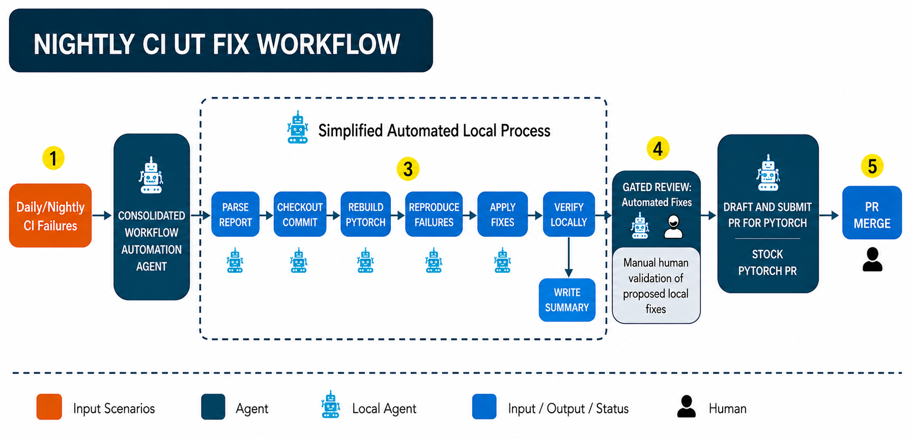

<!-- Copyright 2024-2026 Intel Corporation -->
<!-- Co-authored with GitHub Copilot -->
<!-- Licensed under the Apache License, Version 2.0 -->

# Agentic XPU

AI agent workflows for Intel XPU engineering on PyTorch. Each scenario targets a
specific user problem and is made up of two parts:

1. **Skills** — under `.claude/skills/`. The skill definitions loaded by a custom
   agent (such as OpenCode) or by the agent wired into the scripts.
2. **Scripts** — under `tools/agentic_xpu/`. The scripts that implement the
   end-to-end workflow for the scenario and can be invoked by the user directly.

This page is an overview. For setup and usage, follow the README inside each
scenario folder.

## Scenarios

### 1. CI UT Fix

Automatically fixes nightly CI failures. The agent reads the nightly CI failure
report, then triages, reproduces, categorizes the root cause, applies a fix, and
writes a structured summary for each failing test case.



```
report.md (CI failure report)
      │
      ▼
run_fix.sh (pipeline entry point)
      │
      ├─► OpenCode + SKILL.md (6-step workflow)
      │       │
      │       ├─ Step 1: Parse failure report
      │       ├─ Step 2: Reproduce locally
      │       ├─ Step 3: Analyze & categorize root cause
      │       ├─ Step 4: Load corresponding Skills and Fix
      │       ├─ Step 5: Verify fix + lint
      │       └─ Step 6: Generate summary report
      │
      ▼
summary_<date>.md (structured fix report)
```

Starting point: [nightly_ci_fix/README.md](nightly_ci_fix/README.md)

### 2. XPU Alignment

When a bug is fixed on another backend (CUDA, for example), the same bug may also
affect XPU. This scenario routinely scans `pytorch/pytorch` for issues, PRs, and
bug-fix commits, and generates fix PRs accordingly. The `xpu-alignment` agent
collects candidates that may affect XPU, verifies them locally, and submits an
issue. The Issue Triage Agent then drives the further fix.


```
daily_scan.sh / batch_scan.sh
        │
        ▼
common.sh (env, venv, skill sync)
        │
        ├─► opencode + SKILL.md ─► raw scan JSON
        │
        ▼
audit_scan_report.sh (validate reproducers)
        │
        ▼
render_issue_ready_report.py ─► full_scan.md
render_issue_drafts.py       ─► issue_drafts.md
```

Starting point: [xpu_alignment/README.md](xpu_alignment/README.md)

### 3. Scalable UT Issue Fix

The `issue_handler` agent reads an issue from the given repo, then reads the
skills and tries to fix it automatically. It is composed of several agents:

- **Format Agent** — reorganizes the issue body into a more descriptive format.
- **Triage Agent** — triages the issue, finds the root cause, and proposes
  possible fixes. Runs locally on a machine with XPU available.
- **Fix Agent** — there are two fix agents: an online agent with a Copilot
  backend that lands in `torch-xpu-ops`, and a local agent with an OpenCode
  backend that fixes PyTorch issues. The workflow is split this way to reduce
  CI machine pressure.


```
run_pipeline.py --issues <N>
      │
      ▼
┌─ orchestrator.py ──────────────────────────┐
│                                            │
│  1. format_agent     ─► rewrite body       │
│  2. verify_existence ─► reproduce bug      │
│  3. triage_agent     ─► classify issue     │
│  4. code_fix         ─► generate patch     │
│  5. verify_fix       ─► validate fix       │
└────────────────────────────────────────────┘
      │
      ▼
  Fix PR  (or  NEEDS_HUMAN  if it cannot be handled)
```

Starting point: [issue_handler/README.md](issue_handler/README.md)

### 4. OOB Model Performance Analysis

Analyzes PyTorch OOB (out-of-box) model performance on Intel XPU vs NVIDIA CUDA
using T1/T2/R roofline metrics. It includes scripts for downloading Jenkins
artifacts, generating per-model reports, and producing insight summaries.


```
launch_session.py (trigger 6 Jenkins jobs)
        │
        ▼
download_jenkins_artifacts.py ─► raw_logs/<session>/
        │
        ▼
prepare_flat_views.py ─► flat_views/<session>/
        │
        ├─► generate_all_eager_reports.py    ─► per-model T1/T2/R reports
        ├─► generate_fleet_summary.py        ─► fleet summary
        ├─► compare_graphs.py                ─► graph consistency report
        └─► compare_projection_vs_actual.py  ─► T1 vs actual analysis
        │
        ▼
oob-insights SKILL.md ─► insights_summary.md
```

Starting point: [oob_perf_analysis/README.md](oob_perf_analysis/README.md)

